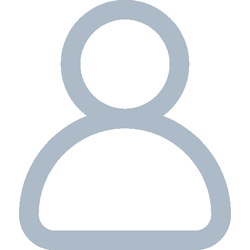

#  Mini Portfólio
O projeto consiste em um mini portfólio, que contém uma aba <b><i>sobre</i></b> que onde tem informações sobre dono do portfólio em si,
e outra aba <b><i>redes</i></b> onde tem as redes sociais do mesmo.
 
Projeto foi desenvolvido durante o evento MadaDev Week.

#  Diferencial
Gostei muito do projeto e resolvi brincar um pouco adicionando pequenas alterações:

- Efeito glassmorphism(vidro embaçado), feito através da propriedade backdrop-filter.
- Borda com iluminação, feito através dos pseudo-elementos before e after,
e as propriedades linear-gradient, filter e animation.
- Responsividade, como optei por deixar o portfólio deitado, tive que usar responsividade 
para deixar ele em pé de novo, fazendo com que ele fique mais adequado em dispositivos menores.

  

### Projeto original:

## 🛠 Tecnologias
- HTML
- CSS
- Javascript
- Git e Github

## ✉️ Contato
leonardo.soares.lim@gmail.com
